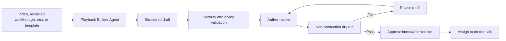
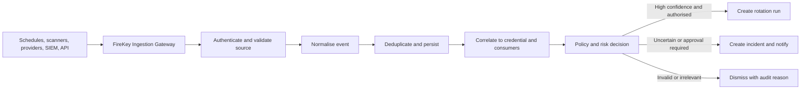
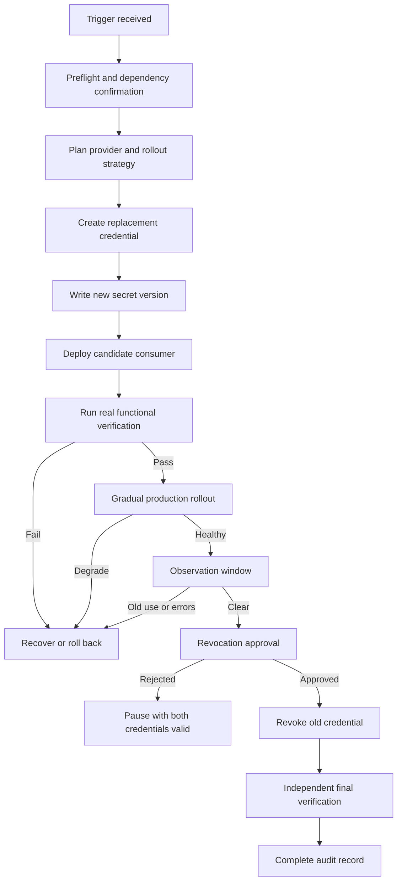
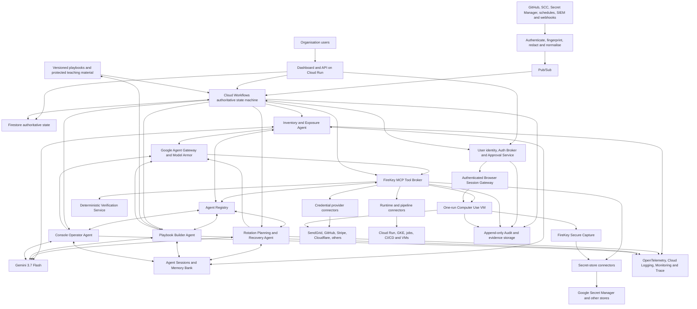

# FireKey

> Agentic credential rotation and incident response without avoidable downtime.

**Last updated:** August 12, 2026

## Overview

FireKey is a hosted platform that safely rotates API keys and other application credentials across credential providers, secret stores, applications, and runtime environments.

An organisation connects the systems it already uses. FireKey maintains a metadata-only inventory of the credentials selected for management, understands which services consume each credential, applies the organisation's rotation policies, and coordinates the complete change:

1. Receive a scheduled, manual, expiry, or security-incident trigger.
2. Identify the affected credential and every service that uses it.
3. Load the credential's approved playbook and determine whether a safe overlapping rotation is possible.
4. Execute the playbook through a provider API or a controlled Computer Use session.
5. Store it as a new version in the organisation's secret store.
6. Deploy and test candidate consumers without disturbing production.
7. Gradually promote the new credential while monitoring real behaviour.
8. Recover automatically if verification or rollout fails.
9. Obtain approval for destructive or policy-controlled actions.
10. Revoke the old credential and independently prove that it no longer works.
11. Preserve a complete audit record.

FireKey is not a password vault, a general SIEM, or a generic chatbot. Its job is to turn a rotation requirement or credential incident into a controlled, observable, recoverable, and verified operational change.

## Product promise

FireKey answers five operational questions:

1. **What credentials are we responsible for?**
2. **Which applications and services use each credential?**
3. **Why must a credential be rotated now?**
4. **Can it be replaced without breaking production?**
5. **Can we prove that the new credential works and the old credential is dead?**

The successful outcome of a FireKey run is not merely “a new key was created.” The successful outcome is:

> Every intended consumer is operating with the replacement credential, the real business workflow has been verified, rollback was available throughout the change, the old credential has been revoked under policy, and the result is recorded in Audit.

## Core concepts

| Concept | Meaning | Example |
| --- | --- | --- |
| Organisation | The customer account using FireKey | Acme Corporation |
| Application | A business system containing one or more services | Acme Store |
| Environment | A deployment boundary such as Development, Staging, or Production | Production |
| Consumer service | The software component that actually uses a credential | `notification-worker` |
| Runtime | The technology running that consumer | Google Cloud Run |
| Credential provider | The system that issues and revokes the credential | SendGrid |
| Managed credential | FireKey's stable logical record across rotations | `production-password-emailer` |
| Credential generation | One concrete provider-side key or token in that record's lineage | `gen_7`, SendGrid key ID `SG.old…` |
| Secret store | Where the credential value is stored for the consumer | Google Secret Manager |
| Secret reference | A generation's pointer to the stored value, not the plaintext value | `sendgrid-api-key`, version 7 |
| Connection | FireKey's authorised integration with an external system | Acme's Google Cloud connection |
| Policy | The rules controlling triggers, tests, rollout, approvals, and revocation | Production SaaS Keys |
| Playbook | The versioned operational method for creating, capturing, verifying, deploying, recovering, and revoking a credential type | SendGrid Mail API Key Rotation v3 |
| Incident | A signal that a credential may be leaked, abused, expired, or otherwise unsafe | GitHub secret-scanning alert |
| Rotation run | One stateful execution of the rotation lifecycle | `ROT-2026-0812-0042` |
| Approval | A recorded human decision at a protected checkpoint | Approve old-key revocation |
| Audit event | An immutable record of an action, decision, result, or state transition | Candidate verification passed |

### Application, environment, service, and runtime

These terms are deliberately separate:

```text
Acme Corporation
└── Acme Store                         Application
    ├── Staging                        Environment
    │   ├── auth-api                   Consumer service
    │   └── notification-worker        Consumer service
    └── Production                     Environment
        ├── auth-api                   Consumer service
        ├── notification-worker        Consumer service
        ├── checkout-api               Consumer service
        └── order-worker               Consumer service

Runtime for the production services: Google Cloud Run
```

A consumer service is the software that reads and uses a credential. The runtime is the infrastructure that executes that software and controls its deployment, configuration, traffic, health, logs, and rollback.

For example:

```text
Application: Acme Store
Environment: Production
Consumer service: notification-worker
Runtime: Cloud Run
Credential: production-password-emailer
Provider: SendGrid
Secret store: Google Secret Manager
```

Only services that actually use a credential are consumers of that credential. Other services can be running in the same application and environment without participating in that rotation.

## Dashboard and navigation

FireKey uses a compact operational navigation model:

```text
┌─────────────────────────────┐
│ FireKey                     │
│ Acme Corporation        ▼   │
├─────────────────────────────┤
│ Overview                    │
│                             │
│ Inventory                   │
│   Credentials               │
│   Applications              │
│                             │
│ Incidents                   │
│ Rotations                   │
│ Approvals               2   │
│ Policies                    │
│ Playbooks                   │
│ Agent Fleet                 │
│ Connections                 │
│ Audit                       │
├─────────────────────────────┤
│ Settings                    │
│ Help                        │
│ Chigozie                ▼   │
└─────────────────────────────┘
```

### Overview

Overview answers, “What needs attention now?”

Its primary status cards are:

```text
Credentials: 48
Healthy: 39
Due soon: 6
Overdue: 3

Open incidents: 2
Rotations in progress: 2
Awaiting approval: 2
Failed rotations: 1
```

The page also shows:

- Active and recently completed rotations.
- Open incidents ranked by severity and confidence.
- Credentials due for rotation.
- Pending approvals.
- Draft, stale, or failed playbooks requiring attention.
- Failed or degraded connections.
- Consumer services still using superseded credential versions.

### Inventory: Credentials

Credentials lists the credential records the organisation has explicitly imported or configured for management.

```text
Credentials                                                   [+]

Search...              Provider ▾   Environment ▾   Status ▾

Name                           Provider   Consumer              Status
production-password-emailer   SendGrid   notification-worker   Due soon
stripe-checkout-key            Stripe     checkout-api          Healthy
github-deploy-token            GitHub     deployment-worker     Rotating
```

The `+` button opens two paths:

```text
Import from connected provider
Configure manually
```

The `+` action opens the credential setup flow.

#### Import from connected provider

The organisation selects an existing provider-side credential, imports it as the current generation of a managed credential, and maps it to the systems that use it:

```text
Provider: SendGrid
Credential: production-password-emailer
Current generation: gen_7
Secret store: Google Secret Manager
Secret reference: sendgrid-api-key
Application: Acme Store
Environment: Production
Consumer service: notification-worker
Policy: Production SaaS Keys
Playbook: SendGrid Mail API Key Rotation v3
```

The provider connection supplies metadata such as the key ID, name, scopes, and creation time where its API permits. Provider APIs generally do not return an existing key's original secret value.

#### Configure manually

Manual configuration supports credentials that cannot be imported through an API:

```text
Name: internal-vendor-production-key
Provider: Internal Vendor Portal
Secret store: Google Secret Manager
Secret reference: internal-vendor-key
Application: Acme Store
Environment: Production
Consumer service: order-worker
Management method: Computer Use
Policy: Production SaaS Keys
Playbook: Internal Vendor Key Rotation v1
```

FireKey stores the mapping and operational metadata. It does not ask the user to paste an existing workload secret into the Inventory record.

#### Credential detail

Opening a credential uses the following tabs:

```text
Overview | Generations | Consumers | Configuration | Rotations | Audit
```

`Configuration` shows the credential's control bindings:

```text
Management method
  Provider API

Playbook
  SendGrid Mail API Key Rotation v3
  Status: Active

Authentication
  Acme SendGrid Admin Connection
  Status: Connected

Policy
  Production SaaS Keys

[View playbook] [Change playbook]
```

The credential detail shows:

- Stable managed-credential identity and the lineage of provider generations.
- Each generation's provider key ID, name, scope, state, fingerprint, creation attempt, and predecessor or successor.
- Secret-store location, generation-to-version relationship, and active consumer bindings.
- Application, environment, runtime, and consumer relationships.
- Rotation policy and next due date.
- Active playbook, execution method, version, and readiness.
- Provider management connection and authentication status.
- Current health and compatibility status.
- Open incidents and active rotation.
- Version history without plaintext secret values.
- Recent provider, deployment, verification, approval, and revocation events.

The relationship view works in both directions:

```text
Credential → every service that consumes it
Service    → every credential it consumes
```

### Inventory: Applications

Applications presents the organisation's operational structure:

```text
Acme Store
├── Development
├── Staging
└── Production
    ├── auth-api
    ├── notification-worker
    ├── checkout-api
    └── order-worker
```

Opening an environment shows its runtime connections, services, deployments, credentials, policies, and active changes. Opening a service shows the secret references it consumes and the specific runtime configuration that binds each secret.

### Incidents

Incidents contains security and operational signals that may require credential rotation.

Each incident displays:

- Source and source-event identifier.
- Severity, confidence, and detection time.
- Affected repository, project, service, or provider resource.
- Correlated FireKey credential candidates.
- Current containment and rotation status.
- Recommended action and the policy that produced it.
- Linked rotation run, approval, and audit trail.

Incident statuses are:

```text
New
→ Correlating
→ Action required
→ Rotation started
→ Contained
→ Resolved
```

An event that is invalid, irrelevant, duplicated, or a confirmed false positive is marked `Dismissed` with a reason and actor.

### Rotations

Rotations is the live operational workspace:

```text
Active | Scheduled | Completed | Failed
```

An active run presents its state instead of hiding the work behind a spinner:

```text
Rotate production-password-emailer

✓ Trigger authenticated and normalised
✓ Credential and consumers confirmed
✓ Provider strategy selected
✓ New SendGrid key created
✓ Secret Manager version 8 created
● Candidate notification-worker verification
○ Production rollout
○ Observation
○ Revocation approval
○ Old-key revocation
○ Independent final verification
```

The run detail includes:

- The original trigger and reason.
- Current stage and owner.
- Agent decisions with grounded inputs.
- Deterministic policy decisions.
- Tool calls and redacted results.
- Candidate tests, logs, metrics, and traces.
- Rollout percentages or consumer-by-consumer progress.
- Recovery and rollback actions.
- Pending approvals.
- A time-ordered event timeline.

For a Computer Use run, the detail page also shows `Live browser` while the VM is active and `Sanitised replay` after each safe checkpoint. Authorised users can watch, request takeover, or review the redacted frames and action timeline. The secret-transfer interval is shown as a protected paused segment; no raw secret-bearing frame exists to replay.

### Approvals

Approvals is the queue for actions requiring human authority.

An approval request contains enough evidence to make the decision:

```text
Revoke old SendGrid key?

Credential: production-password-emailer
Reason: Scheduled 90-day rotation
Consumers migrated: 1 of 1
Candidate functional test: Passed
Production observation: 30 minutes
Authentication errors: 0
Old-key usage during observation: None
Rollback available: Yes

[Reject] [Request more evidence] [Approve revocation]
```

Approvals can protect:

- Emergency rotation initiation.
- Changes that cannot support overlapping credentials.
- Production rollout.
- Immediate containment that may interrupt service.
- Old-credential revocation.
- Destructive browser actions.

Every approval is bound to the exact proposed action rather than only to the run. FireKey computes an action digest over the organisation, run, credential generation, playbook and policy versions, tool name, canonical parameters, expected preconditions, and evidence snapshot. The approval stores that digest, the approver identity, decision, expiry, and hash and consumption state of a one-shot callback capability. If any protected input changes, the digest changes and FireKey must request a new approval; replaying an old approval cannot authorise a different action. Notification links return the user to the authenticated FireKey application; they never expose a raw Workflows callback URL or approval capability.

### Policies

Policies define what FireKey may do and what must be true before it proceeds.

A policy contains:

```text
Policy: Production SaaS Keys

Triggers
  Scheduled: Every 90 days
  Incident: Verified leak or suspected abuse

Credential requirements
  Preserve or reduce current permissions
  Reject unexpected scope expansion

Pre-production verification
  Provider validation required
  Secret-store write confirmation required
  Candidate deployment required
  Real functional probe required

Rollout
  Strategy: Gradual where supported
  Stages: 5% → 25% → 50% → 100%
  Abort threshold: Any authentication failure above baseline

Observation
  Duration: 30 minutes
  Require no old-key usage before revocation

Approvals
  Emergency containment: Security Admin
  Old-key revocation: Security Admin or Platform Owner

Recovery
  Preserve the old credential until promotion is verified
  Automatically return traffic to the last healthy revision
```

Policies can be assigned by environment, provider, credential type, application, or individual credential. A more specific assignment overrides a broader default only where the organisation has permission to create that override.

### Playbooks

A playbook is a reusable, versioned definition of how FireKey manages a type of credential. It describes the complete operational method:

```text
Create replacement
→ capture and store it safely
→ verify it
→ deploy it to consumers
→ recover from failure
→ revoke the old credential
→ prove the final state
```

Policies and playbooks have separate responsibilities:

```text
Policy   → when FireKey may act and which safety conditions apply
Playbook → how FireKey performs the provider- and credential-specific operation
```

One playbook can be assigned to several credentials:

```text
SendGrid Mail API Key Rotation v3
├── production-password-emailer
├── staging-password-emailer
└── production-notification-emailer
```

The Playbooks page lists reusable automations:

```text
Playbooks                                                        [+]

Name                              Provider    Execution       Status
SendGrid Mail API Key Rotation    SendGrid    Provider API    Active
GitHub Deploy Key Rotation        GitHub      Provider API    Active
Internal Vendor Key Rotation      Custom      Computer Use    Draft
```

The `+` action opens Playbook Builder:

```text
Create playbook

[Start from FireKey template]
[Record browser walkthrough]
[Upload video]
[Write instructions]
[Video and instructions]
```

#### FireKey-managed playbooks

FireKey-managed playbooks are built and maintained for supported provider APIs. They define typed connector actions, provider capability checks, verification requirements, and revocation behaviour. Organisations can configure permitted inputs but cannot change protected connector logic.

#### Organisation-managed playbooks

Organisation-managed playbooks support internal systems and provider consoles without an adequate management API. An organisation teaches FireKey by supplying:

- A browser walkthrough recorded in an isolated, non-production session.
- An uploaded instructional video.
- Written operational instructions.
- Safe test data and expected results.
- The provider domain, authentication requirements, and protected actions.

Video and text are source material; they are not executed directly. The Playbook Builder Agent converts them into a structured draft that an authorised user must review, test, and approve.

#### Playbook structure

Opening a playbook uses:

```text
Overview | Authentication | Create | Capture | Verify | Deploy | Revoke | Recovery | Versions
```

An approved playbook contains:

```yaml
name: Internal Vendor Key Rotation
version: 1
provider: Internal Vendor Portal
execution: computer_use

allowed_domains:
  - vendor.example.com

inputs:
  - credential_name
  - required_scopes

create:
  - navigate: Administration > API Keys
  - action: Create API Key
  - enter: credential_name
  - select: Restricted Access
  - configure_scopes: required_scopes
  - protected_action: Create
  - secure_capture: generated_api_key

verify:
  - confirm_provider_key_name
  - confirm_permission_scopes
  - run_consumer_functional_test

revoke:
  - locate_by_provider_key_id
  - protected_action: Delete
  - verify_old_credential_rejected
```

The stored format also declares permitted tools, provider selectors, expected page states, timeouts, retry limits, safe checkpoints, recovery branches, and evidence requirements. It stores semantic goals and guarded actions rather than relying only on fragile screen coordinates.

#### Teaching and activation flow



A playbook moves through:

```text
Draft → Validating → Test required → Approval required → Active → Superseded
```

FireKey does not activate a playbook merely because a model extracted steps from a video. Activation requires structural validation, an authorised review, and a successful dry run against a safe environment or disposable credential.

#### Versioning and interface change

Active versions are immutable. Editing creates a new draft version. Every rotation records the exact playbook version executed.

During Computer Use execution, FireKey compares the current interface with the approved checkpoints. Minor layout changes can be handled by the Console Operator Agent. Missing controls, unexpected domains, new permission choices, substantially different flows, or unrecognised security prompts cause the run to pause and the playbook to become `Review required`.

### Agent Fleet

Agent Fleet is the organisation's catalogue of FireKey's four institutional agents. It is backed by Google Agent Registry and shows each agent's version, owner, registered skills, deployment region, runtime status, identity, approved callers, tool access, recent traces, and linked playbook or run activity.

| Agent | Registered skills | Cross-department value |
| --- | --- | --- |
| Inventory and Exposure Agent | `correlate_exposure`, `resolve_consumers`, `detect_stale_mapping`, `estimate_blast_radius` | Security and platform teams share one evidence-backed exposure and dependency view |
| Rotation Planning and Recovery Agent | `plan_rotation`, `select_strategy`, `bind_playbook`, `diagnose_failed_stage`, `recommend_authorised_recovery` | Platform engineering, SRE, security, and change management share one guarded change and recovery plan |
| Playbook Builder Agent | `build_playbook`, `analyse_walkthrough`, `generate_dry_run` | Operations enablement and service owners turn institutional knowledge into reviewable automation |
| Console Operator Agent | `execute_console_playbook`, `detect_interface_drift` | Operations and legacy-system owners reuse governed console procedures without granting a general administrator agent |

These are four separately deployed and registered agents, not four labels inside one general-purpose prompt. Departments discover approved capabilities in the Registry-backed Fleet view and request them through the FireKey API; Cloud Workflows invokes the selected agent endpoint. Discovering an agent never grants broader production permissions. Google Agent Identity, IAM policy, Agent Gateway, the FireKey Tool Broker, and the run's policy continue to constrain every call.

### Connections

Connections are the authorised integrations FireKey uses to observe and act.

A connected system can provide more than one capability:

```text
SendGrid
  Roles: Credential provider

Google Cloud
  Roles: Secret store, runtime, telemetry, incident source

GitHub
  Roles: Incident source, repository context, pipeline runtime
```

Connections use the safest supported authorisation method:

1. Workload identity or short-lived federation.
2. OAuth with limited scopes.
3. A dedicated, least-privilege management credential.
4. A controlled browser session when no adequate programmatic interface exists.

The credential being rotated is the **workload credential**. The connection used to create and revoke it is a separate **management connection**. A `mail.send` SendGrid key, for example, cannot create its own replacement unless it has inappropriate management permissions. FireKey uses a separate, restricted provider-management connection for that operation.

Every connection records:

- Organisation and owner.
- Granted scopes and supported capabilities.
- Last successful health check.
- Token or session expiry.
- Allowed resources and environments.
- Whether API execution, Computer Use, or both are available.
- The FireKey service identity authorised to use it.

#### Auth Broker

The FireKey Auth Broker is the deterministic security service that establishes and maintains authorised access to connected systems. It is not an AI model.

It handles two distinct boundaries:

```text
FireKey authentication
  Organisation SSO, user MFA, session management, roles, approvals

Provider authentication
  OAuth grants, workload identity, management credentials,
  browser sessions, expiry, reauthentication, and human takeover
```

For API execution, the Auth Broker supplies scoped authorisation to the FireKey MCP Tool Broker. For Computer Use, it attaches an authenticated provider session to an isolated browser VM before the Console Operator Agent begins. Raw passwords, OAuth refresh tokens, session cookies, and MFA values are never added to agent prompts.

If authentication expires during a run:

```text
Pause playbook
→ notify an authorised user
→ user completes login or MFA in the isolated session
→ Auth Broker validates the renewed session
→ resume from the recorded checkpoint
```

FireKey does not solve CAPTCHAs, bypass MFA, or ask the Console Operator Agent to decide whether a provider's authentication control can be circumvented.

### Audit

Audit is the permanent record of every security-relevant action, decision, and supporting result.

An audit record contains:

- Actor: human, policy, agent, connector, or external source.
- Action and reason.
- Credential, application, environment, and run identifiers.
- Before and after references without plaintext secrets.
- Policy version and approval records.
- Tool invocation and redacted result.
- Verification results and timestamps.
- Failure, retry, recovery, and rollback events.
- Provider revocation result.
- Final old-key and new-key tests.
- Integrity metadata for tamper detection.

Audit supports filtered search and export for incident review, change management, and compliance workflows.

Firestore stores only the searchable audit index. Canonical audit events are append-only, hash-chained, and written to a dedicated regional Cloud Logging bucket with retention locked and CMEK where required. Larger evidence objects, including sanitised browser replay frames and exported reports, are kept in a retention-locked Cloud Storage evidence bucket and referenced by content hash. Neither store contains plaintext credential values or raw secret-bearing browser frames.

## Connections and system mapping

FireKey does not assume that connecting a provider proves how every credential is used. Connections expose authorised metadata; the organisation confirms the operational mapping.

### Provider import

Where supported, FireKey can request provider-side metadata:

```text
Provider key ID
Display name
Permission scopes
Creation time
Last-used metadata
Expiry or status
```

It does not expect the provider to return the original secret value.

### Secret-store mapping

The secret-store connection supplies:

```text
Secret resource name
Available versions and states
Rotation schedule metadata
IAM bindings relevant to the secret
```

Existing plaintext versions are not read merely to populate Inventory.

### Runtime mapping

The runtime connection supplies:

```text
Application services and jobs
Environment and project identifiers
Secret references in deployment configuration
Current revisions or releases
Traffic or rollout controls
Service identities
Health, logs, metrics, and traces
```

For example:

```text
Cloud Run service: notification-worker
Environment variable: SENDGRID_API_KEY
Source: Secret Manager / sendgrid-api-key / version 7
```

### Confirmed mapping

A managed credential becomes `Ready` when FireKey has a confirmed relationship between:

```text
Provider credential
        ↕
Secret-store reference
        ↕
Application and environment
        ↕
Every consumer service
        ↕
Active playbook version
        ↕
Rotation policy
```

If FireKey finds an unregistered secret reference or an unresolved provider match, it presents a suggestion. It does not silently assert that the relationship is correct.

## Trigger and ingestion layer

FireKey includes a first-class ingestion layer. Its role is to receive signals that may require rotation and convert them into authenticated, deduplicated, correlated FireKey incidents or rotation requests.

FireKey does not replace the organisation's source-code scanner, cloud threat detector, or SIEM. Those systems detect suspicious conditions. FireKey owns the credential-specific response: identify the managed credential, determine a safe course of action, rotate it, verify recovery, and close the loop.

### Trigger sources

FireKey accepts:

| Trigger | Example | Typical response |
| --- | --- | --- |
| Manual | Operator clicks `Rotate` | Start under the assigned policy |
| FireKey schedule | Credential reaches its 90-day due date | Routine rotation |
| Secret-store schedule | Google Secret Manager emits `SECRET_ROTATE` | Routine rotation |
| Repository leak alert | GitHub secret scanning creates or reopens an alert | Emergency triage and rotation |
| Cloud security finding | Security Command Center publishes an active finding | Correlate and contain |
| Provider signal | Provider reports expiry, disablement, abuse, or compromise | Emergency or recovery flow |
| SIEM/SOAR webhook | Splunk, Chronicle, or another platform sends a finding | Policy-based triage |
| FireKey telemetry | Authentication errors spike or old-key use continues | Pause, recover, or escalate |
| FireKey API | An authorised internal system submits a request | Policy-based rotation |

Google Secret Manager can publish a `SECRET_ROTATE` message to Pub/Sub at a configured rotation time. Security Command Center can publish new and updated findings to Pub/Sub in near real time. GitHub exposes secret-scanning alerts through webhooks and APIs.

### Ingestion pipeline



#### 1. Authenticate

FireKey validates each source before processing its payload:

- Webhook HMAC signatures and delivery identifiers.
- Google Cloud IAM-authenticated Pub/Sub delivery.
- OAuth or service-account identity.
- Timestamp and replay-window checks.
- Organisation-specific ingestion endpoint and source binding.

#### 2. Normalise

Every source becomes a canonical event:

```json
{
  "event_id": "github:delivery:7c94...",
  "organisation_id": "org_acme",
  "source": "github_secret_scanning",
  "type": "credential_exposure_detected",
  "observed_at": "2026-08-12T09:42:31Z",
  "severity": "critical",
  "confidence": "high",
  "resource": {
    "repository": "acme/store-api",
    "environment_hint": "production",
    "provider_hint": "sendgrid"
  },
  "source_reference": "github-alert-1842"
}
```

The canonical record contains references and safe metadata. FireKey does not place an exposed plaintext secret into agent prompts, logs, Firestore, or Audit.

#### 3. Deduplicate

The same provider event may be delivered more than once. FireKey uses the organisation, source, source-event ID, and event type as an idempotency key. Duplicate delivery updates the existing incident rather than starting a second rotation.

Undeliverable events are retried and eventually routed to a dead-letter queue for operator review. A rotation run also holds a renewable lease with a monotonically increasing fencing token on its credential. Every mutation includes the current token, so a delayed worker whose lease expired cannot continue changing the credential after a replacement worker takes ownership.

#### 4. Correlate

The Inventory and Exposure Agent and deterministic indexes compare the event with:

- Provider type and provider credential IDs.
- Repository-to-application mappings.
- Application, environment, and service ownership.
- Secret references used by those services.
- Existing credential incidents and runs.
- Provider status or validity checks where available.

Correlation returns candidates with reasons and confidence. When there is one verified match, policy may allow automatic response. When several credentials could match, FireKey asks an authorised person to confirm the affected credential.

#### 5. Decide and notify

The policy engine determines the permitted action:

| Condition | FireKey behaviour |
| --- | --- |
| Scheduled and credential is healthy | Start routine rotation |
| Verified leak, exact credential match, emergency policy enabled | Notify immediately and start emergency rotation |
| High-risk incident but revocation could cause an outage | Prepare replacement, test it, request containment decision |
| Multiple possible credential matches | Create incident and request mapping confirmation |
| Low-confidence finding | Notify and hold for triage |
| Duplicate or already-contained finding | Link to existing incident and run |

Notifications can be delivered in-app and through configured email, Slack, or incident-management channels. Notification links open the authenticated FireKey incident or approval page; sensitive decisions are not executed merely by replying to a message.

### Routine and emergency modes

Routine rotation prioritises continuity:

```text
Create replacement
→ verify candidate
→ migrate every consumer
→ observe
→ revoke old credential
```

Emergency rotation balances continuity with containment:

```text
Validate incident
→ determine exposure and blast radius
→ create replacement immediately where authorised
→ migrate the highest-risk consumers first
→ revoke as soon as the emergency policy permits
→ verify containment
```

If a compromised credential is actively being abused, leaving it valid for a long observation window may be more dangerous than a short interruption. FireKey makes that trade-off explicit through the emergency policy and human approval rules; an agent does not silently choose it.

## Rotation strategies

The provider and consumer capabilities determine the safe strategy.

### Parallel credential strategy

This is the preferred zero-downtime strategy:

```text
Old credential remains valid
        +
New credential is created
        ↓
Consumers migrate and verify
        ↓
Old credential is revoked
```

It applies when the provider permits two independently valid credentials with equivalent or narrower scopes.

### Dual-slot strategy

Some systems expose primary and secondary credential slots. FireKey writes the inactive slot, migrates consumers, promotes it, and then replaces the old slot.

### Immediate-invalidation strategy

Some provider “roll” operations immediately invalidate the previous value. FireKey does not describe these as zero-downtime unless consumer behaviour provides another safe overlap mechanism.

Before proceeding, FireKey must either:

- Find an alternate parallel-key method.
- Coordinate an atomic consumer update.
- Use a documented reload mechanism with bounded disruption.
- Request approval for a maintenance window.
- Mark safe automatic rotation as unsupported.

### Multi-consumer strategy

One credential may be used by several services:

```text
production-mailer-key
├── notification-worker
├── support-worker
└── invoice-worker
```

FireKey creates one dependency plan and tracks every consumer separately. The old key cannot be revoked until all required consumers have migrated or an emergency containment policy explicitly accepts the impact.

### Playbook execution paths

Every credential uses an active playbook. The playbook chooses the safest available execution path in this order:

1. Official provider API.
2. Supported CLI or infrastructure provider interface.
3. Gemini Computer Use in a one-run isolated Compute Engine browser VM.
4. Human-assisted step when automation cannot be made safe.

Computer Use is not a shortcut around provider controls. MFA, confirmation requirements, and safety blocks remain in force.

For a browser-managed credential, the Auth Broker establishes the provider session and the Console Operator Agent executes the approved playbook:

```text
Auth Broker attaches authenticated session
→ Console Operator Agent opens the allowed provider domain
→ follow approved playbook checkpoints
→ prepare the new credential configuration
→ request confirmation for sensitive action where required
→ create credential
→ Secure Capture transfers the one-time value to the secret store
→ verify provider metadata
→ later return for approved revocation
```

Provider pages can contain untrusted or adversarial text. Browser workers use domain allowlists, prompt-injection detection, restricted actions, isolated profiles, step budgets, and explicit confirmation for destructive operations.

If a newly generated secret appears in the browser, Secure Capture transfers it directly to the configured secret store and masks it from subsequent screenshots. Secure Capture is a FireKey component, not a Gemini or Google Cloud product. If FireKey cannot prove that the field was captured and masked before another screenshot, the model loop and recording freeze and the run switches to an authorised human-assisted secure transfer.

## Rotation lifecycle

Every FireKey rotation is a durable state machine. It can pause for minutes or days, resume after process restarts, retry safe steps, and recover from partial failure.

The state machine retains all 12 safety stages. The dashboard and demo group them into six parent phases to reduce operator navigation without removing work:

```text
Detect and scope       Stages 1–2
Plan                   Stage 3
Prepare replacement    Stages 4–6
Validate and promote   Stages 7–9
Approve and retire     Stages 10–11
Prove and close        Stage 12
```



### Stage 1: Trigger intake

FireKey records:

- Who or what requested the rotation.
- Source event and reason.
- Requested urgency.
- Credential, application, and environment hints.
- Applicable policy version.

It authenticates the request, deduplicates it, checks for an existing active run, and obtains the credential's renewable lease and fencing token.

### Stage 2: Preflight

Preflight confirms that FireKey has enough information and authority to act:

- Provider connection is healthy.
- Credential exists and is active or its current condition is known.
- Current scopes and required replacement scopes are known.
- An active, approved playbook is assigned to the credential.
- The playbook's required provider-management connection is authenticated.
- Secret-store connection is healthy.
- Consumer list is complete enough for the policy.
- Runtime deployment and rollback controls are available.
- Functional verification is configured.
- Required human approvers exist.
- The provider supports the selected overlap strategy.
- Every provider mutation declares its retry or compensation semantics, and any required reconciliation or orphan-cleanup permission is available before creation.
- No incompatible change is already running.

If zero-downtime rotation is not feasible, FireKey stops before creating a destructive change and explains the exact limitation.

### Stage 3: Select and bind the playbook

The Rotation Planning and Recovery Agent loads the credential's active playbook and binds its approved steps to the current provider, secret-store, runtime, policy, and consumer context:

```text
Playbook: SendGrid Mail API Key Rotation v3
Execution: Provider API
Management connection: Acme SendGrid Admin
Provider operation: Create a second SendGrid key
Required scope: mail.send
Secret operation: Add Secret Manager version 8
Consumer operation: Deploy notification-worker candidate revision
Verification: Send password-reset test to controlled inbox
Rollout: 5% → 25% → 50% → 100%
Observation: 30 minutes
Revocation: Human approval required
Recovery: Restore old revision and retain old key
```

The deterministic policy engine validates the bound plan. An inactive playbook, unapproved version, scope expansion, missing consumer, unavailable rollback, forbidden tool, unauthenticated connection, or omitted approval causes rejection.

### Stage 4: Create replacement credential

Cloud Workflows dispatches the approved creation operation to the FireKey MCP Tool Broker. An API or CLI connector performs deterministic mutations. Only a console-only operation is delegated to the Console Operator Agent in an isolated Computer Use VM. The operation creates a new credential with the intended name, scope, resource boundary, expiry, and network restrictions.

Each connector declares one mutation mode:

| Mutation mode | Retry rule |
| --- | --- |
| Native idempotency | Retry with the provider-supported idempotency token |
| Reconcilable | Resolve the result through a deterministic provider ID, request-status endpoint, or unique lookup before retrying |
| Compensatable non-idempotent | Do not retry an ambiguous create; quarantine or revoke the possible orphan, then create a replacement under a new attempt |

The contract also declares whether the secret is retrievable after creation, which deterministic lookup methods exist, and which compensation is safe. A run tag or display name is useful evidence but is never treated as an idempotency guarantee unless the provider contract proves uniqueness. SendGrid key creation is therefore `compensatable non-idempotent`: a lost response pauses blind retry, attempts safe reconciliation using available metadata, and otherwise requires cleanup or authorised recovery before another key is created.

### Stage 5: Store the new secret version

The secret payload travels through a restricted secret channel:

```text
Provider connector or Secure Capture
→ ephemeral secret broker
→ organisation's secret store
```

The language model receives only handles such as:

```text
credential_id: cred_sendgrid_prod_mailer
secret_reference: projects/acme-prod/secrets/sendgrid-api-key/versions/8
```

It does not receive the secret value.

FireKey verifies that the new version exists and is accessible to the intended consumer identity without changing the live binding.

### Stage 6: Candidate deployment

FireKey deploys the intended consumer with an explicit reference to the new version. It does not rely on an uncontrolled `latest` pointer for a production canary.

For Cloud Run:

```text
Current revision: notification-worker-r17 → secret version 7
Candidate revision: notification-worker-r18 → secret version 8
Candidate traffic: 0%
Candidate tag: firekey-rot-0042
```

The tagged candidate can be addressed directly for verification before receiving production traffic.

The runtime connector also injects `FIREKEY_GENERATION_ID=gen_8` and the equivalent `firekey.credential_generation` OpenTelemetry resource attribute. FireKey's consumer middleware copies that non-secret identifier onto credential-dependent spans and functional-test results; the credential value itself is never logged.

### Stage 7: Pre-live verification

The deterministic Verification Service executes the configured probes and evaluates their typed results against policy. It does not ask an agent to decide whether its own mutation succeeded. Before production switches, FireKey must pass all applicable gates:

1. **Provider gate** — the new credential exists, is enabled, and has no unexpected permission expansion.
2. **Secret-store gate** — the new version exists and the correct consumer identity can access it.
3. **Deployment gate** — the candidate is running with the intended version, not a cached or previous value.
4. **Functional gate** — the candidate completes the real credential-dependent job.
5. **Result gate** — the downstream effect is confirmed, not merely accepted asynchronously.
6. **Telemetry gate** — logs, metrics, traces, latency, retries, and authentication failures are within policy.
7. **Coverage gate** — every required consumer is included in the plan.
8. **Rollback gate** — the previous healthy revision and old credential remain available.

A `/health` response alone does not prove a credential works. Verification must exercise the actual dependency.

### Stage 8: Production rollout

The rollout mechanism depends on the runtime:

| Runtime or consumer | Rollout method |
| --- | --- |
| Cloud Run service | Tagged candidate followed by percentage-based traffic migration |
| GKE deployment | Canary or rolling deployment with explicit secret version |
| Worker pool | Start a controlled candidate worker, verify a test job, then drain and replace old workers |
| Scheduled job | Invoke a candidate job with a synthetic task, then update the schedule binding |
| VM service | Blue/green process, safe reload, or approved restart procedure |
| CI/CD pipeline | Test workflow with new secret, update the protected environment, then wait for in-flight jobs |

At every stage FireKey compares actual results with policy thresholds. A detected regression stops promotion and starts recovery.

### Stage 9: Observation

At 100% rollout, FireKey observes:

- Credential-dependent success rate.
- Provider authentication failures.
- Application errors and retries.
- Latency changes.
- Old secret-version access.
- Requests from unmigrated consumers.
- Provider-side old-key usage where available.

Every candidate deployment also emits a non-secret `FIREKEY_GENERATION_ID` in logs, traces, and verification events. FireKey uses that signal with the explicit runtime binding and functional probe to prove which credential generation served the request. Secret-store access logs alone are supporting evidence: a long-running process may already hold a credential in memory and make no new secret-store read during the observation window.

The observation period can be shortened under an emergency policy or extended when traffic is too low to provide confidence.

### Stage 10: Revocation approval

FireKey presents the approver with the trigger, plan, test results, rollout history, observation data, consumer coverage, rollback state, and known residual risk.

The approval is bound to the exact revocation action digest, plan hash, credential generation, evidence snapshot, and expiry. Any material change after the approval screen was generated invalidates it and returns the run to `Approval required`.

The approver may:

- Approve revocation.
- Reject revocation.
- Request more evidence.
- Extend observation.
- Exclude a non-critical consumer under an authorised exception.

### Stage 11: Revoke and clean up

After approval, FireKey:

1. Re-checks the approval digest, consumer-generation bindings, observation evidence, and current fencing token immediately before the irreversible step.
2. Prepares a restricted negative-test handle for the old credential where the provider supports a safe authentication probe. If plaintext is required, a deterministic verifier reads it just in time from the still-enabled old secret version into ephemeral memory; it is never sent to an agent, log, screenshot, or audit event.
3. Uses the playbook's approved revocation stage to disable, revoke, or delete the provider-side old credential.
4. Re-verifies the replacement.
5. Uses the restricted verifier to prove that the old credential is rejected, then zeroises the ephemeral buffer.
6. Disables the old secret-store version after the negative test succeeds.
7. Destroys the old secret version only when the retention policy permits.

The old secret-store version remains available only to authorised identities until the immediate post-revocation negative test completes. If the verifier restarts, it can reconstruct the restricted handle without copying the secret elsewhere. Provider disablement or revocation, secret-version disablement, and secret destruction remain separate audited steps. Rollback is possible while the provider-side old credential is valid; after irreversible provider revocation, recovery is an authorised roll-forward that creates another replacement generation.

### Stage 12: Complete

The run completes only when:

```text
New provider credential is valid
Every required consumer uses the new secret reference
The real functional test passes
Production remains healthy
Old provider credential is revoked
Old credential fails an independent negative test
Audit contains the full operation and approvals
```

## Agentic system

FireKey uses four bounded institutional agents built with Gemini and Google's Agent Development Kit. Each agent is separately deployed to Agent Runtime, automatically catalogued in Agent Registry, and assigned its own Agent Identity and registered skills. Four is sufficient because each boundary represents a genuinely different kind of adaptive reasoning; deterministic orchestration, policy, verification, and mutation execution are services rather than agents.

Cloud Workflows is the authoritative coordinator. It selects eligible stages, dispatches bounded tasks, waits for callbacks and timers, enforces leases, and resumes long-running runs from Firestore. Removing a Coordinator Agent avoids a second, competing state machine.

### Inventory and Exposure Agent

Registered skills: `correlate_exposure`, `resolve_consumers`, `detect_stale_mapping`, and `estimate_blast_radius`.

The Inventory and Exposure Agent:

- Interprets normalised security findings.
- Correlates repositories, services, providers, secret references, and credential candidates.
- Builds the credential-consumer graph from confirmed Inventory data and live connector metadata.
- Finds services, jobs, pipelines, and environments that reference a credential.
- Detects conflicting, incomplete, or stale mappings.
- Explains correlation confidence, urgency, ambiguity, and likely blast radius.
- Refuses to declare coverage complete while material relationships remain unresolved.

It cannot revoke a credential merely because a model labels an incident critical. Deterministic policy and human authority decide what action is permitted.

### Rotation Planning and Recovery Agent

Registered skills: `plan_rotation`, `select_strategy`, `bind_playbook`, `diagnose_failed_stage`, and `recommend_authorised_recovery`.

The Rotation Planning and Recovery Agent reasons across the assigned playbook, provider, runtime, current evidence, and policy. It:

- Selects parallel, dual-slot, immediate-invalidation, or manual strategy.
- Determines whether zero-downtime rotation is feasible.
- Binds the playbook's API, CLI, Computer Use, or human-assisted path to the current connections and consumers.
- Builds the candidate test, rollout, observation, rollback, and revocation plan.
- Adapts the plan to routine or emergency conditions.
- Diagnoses ambiguous failures from redacted evidence.
- Recommends only retry, rollback, roll-forward, or escalation branches already authorised by the playbook and policy.

It produces a typed plan or recovery recommendation. The policy engine validates it and Cloud Workflows executes only eligible transitions.

### Playbook Builder Agent

Registered skills: `build_playbook`, `analyse_walkthrough`, and `generate_dry_run`.

The Playbook Builder Agent converts operational knowledge into a reviewable automation draft. It:

- Analyses written instructions, uploaded videos, and recorded browser walkthroughs.
- Identifies goals, inputs, page states, actions, outputs, protected steps, and failure branches.
- Produces a structured playbook instead of replaying raw clicks or video frames.
- Flags unclear authentication, secret exposure, ambiguous selectors, and destructive actions.
- Generates dry-run scenarios and expected checkpoints.
- Revises a draft from authorised reviewer feedback and test results.

It cannot activate its own output. Deterministic validation, an authorised review, and a successful dry run are required before a version becomes active.

### Console Operator Agent

Registered skills: `execute_console_playbook` and `detect_interface_drift`.

The Console Operator Agent exists only for provider operations without an adequate management API. It:

- Navigates an allowed provider console through Gemini Computer Use.
- Follows an approved, versioned playbook and expected page checkpoints.
- Adapts only to bounded, non-semantic layout changes.
- Stops at authentication, safety, Secure Capture, and approval checkpoints.
- Detects material interface drift and requests playbook review.

It receives page state with protected fields redacted and typed tool results with secret references, never raw credential values. It cannot directly deploy consumers, shift traffic, write arbitrary secrets, or call arbitrary provider endpoints. Those deterministic operations remain behind the FireKey MCP Tool Broker.

### Deterministic Verification Service

Verification is deliberately not a fifth agent. A model must not grade its own work. The Verification Service:

- Runs credential-specific functional probes from versioned definitions.
- Checks provider, secret-store, deployment, result, telemetry, coverage, and rollback gates.
- Correlates generation IDs, downstream effects, logs, metrics, and traces using deterministic rules.
- Detects partial migration and hidden old-generation use.
- Performs the final positive test for the new credential and restricted negative test for the old one.
- Returns typed evidence and pass, fail, or inconclusive status to Cloud Workflows.

An inconclusive or failed result may invoke the Rotation Planning and Recovery Agent for bounded diagnosis, but the agent cannot rewrite the measured result or bypass a gate.

### What makes FireKey agentic

FireKey is agentic because it can take a high-level objective such as:

```text
Safely rotate the production SendGrid credential affected by this leak.
```

It then:

- Builds context across multiple connected systems.
- Resolves incomplete mappings and provider-specific constraints.
- Converts an organisation's demonstration into a guarded, testable playbook draft.
- Chooses an execution strategy.
- Operates the current provider interface when no adequate API exists.
- Uses tools to make real changes.
- Works asynchronously through long-running stages.
- Maintains state across pauses and approvals.
- Evaluates real-world outcomes rather than stopping at API acceptance.
- Recovers when the environment behaves differently from the initial plan.

The agents are not free-running administrators. The following controls remain deterministic:

- Identity and access control.
- Organisation and tenant boundaries.
- Policy evaluation.
- Allowed tools and parameters.
- Workflow stage transitions, timers, leases, and fencing tokens.
- Connector retry and compensation semantics.
- Approval requirements.
- Rollout thresholds.
- Verification gates and measured results.
- Secret redaction.
- Audit recording.
- Terminal success criteria.

This combination provides useful adaptive reasoning without making production safety depend on an unconstrained model response.

## System architecture



### Dashboard and API

The dashboard and authenticated API run on Cloud Run. They provide tenant-aware access to Inventory, Incidents, Rotations, Approvals, Policies, Playbooks, Agent Fleet, Connections, and Audit.

### Ingestion Gateway and Pub/Sub

The Ingestion Gateway terminates authenticated webhooks and cloud events. It validates source identity before publishing safe canonical events to Pub/Sub.

Pub/Sub decouples external event arrival from incident processing and rotation execution. Consumers use idempotency records even when delivery guarantees are configured, because operational side effects must remain safe under retry and replay.

### Workflow orchestration

The workflow layer owns deterministic stage transitions, retries, timers, timeouts, approvals, and compensation paths. Google Cloud Workflows callbacks can suspend a run until an authorised approval or external verification resumes it.

The workflow engine, not the model, decides whether the state machine may advance.

### Agent runtime

The four ADK agents run as separate deployments on Gemini Enterprise Agent Platform Agent Runtime. Deployment registers them in Agent Registry and gives each agent an independently governable version, identity, endpoint, skills card, and observability surface. Cloud Run remains the host for FireKey application services; it is not presented as a substitute agent runtime in this architecture.

### Operational state, Sessions, and Memory Bank

FireKey deliberately uses three state layers:

| Layer | Purpose | Must not contain |
| --- | --- | --- |
| Firestore | Authoritative runs, stages, leases, plans, approvals, policy versions, generation bindings, and terminal results | Plaintext secrets |
| Agent Platform Sessions | Redacted chronological context for one bounded agent interaction or run task | Authority to advance a workflow |
| Memory Bank | Approved, non-sensitive cross-run knowledge such as provider quirks, stale-mapping patterns, playbook lessons, and organisation preferences | Secrets, session tokens, approval capability, or unverified operational state |

Session and memory retrieval are tenant-, region-, agent-, and purpose-scoped. A memory is advisory context with provenance and expiry; it cannot override Firestore, live connector evidence, the active playbook, or current policy.

A run that lasts for weeks does not keep a model process alive. Cloud Workflows waits on timers or callbacks, Firestore retains the authoritative checkpoint and lease state, and the next bounded agent invocation receives a newly constructed redacted context plus only relevant, policy-eligible memories. This makes long-running continuity reproducible instead of depending on an indefinitely open conversation.

### Data sovereignty and regional deployment

An organisation selects a supported Google Cloud region when its FireKey environment is provisioned. Firestore, Agent Runtime, Sessions, Memory Bank, Workflows, Pub/Sub, logs, evidence storage, CMEK keys, and Computer Use VMs are created in or constrained to that approved regional boundary where the selected service supports it. Organisation policy blocks cross-region agent, model, tool, and evidence routes; unsupported provider or model geography is disclosed before activation rather than silently falling back.

FireKey records the region for every agent deployment, run, session, memory, browser session, audit event, and evidence object. An enforced project location policy admits only the selected region for services that support resource-location constraints. VPC Service Controls protects the supported Google data APIs inside the project perimeter; it does not claim to govern third-party internet traffic. Private service access, IAM, CMEK, retention policy, Agent Gateway, and Secure Web Proxy provide the remaining service-appropriate layers.

### Firestore

Firestore stores tenant-scoped metadata and operational state:

- Organisations, users, roles, and settings.
- Connections and capability metadata.
- Applications, environments, services, and mappings.
- Managed credentials, provider identities, credential generations, secret references, and per-consumer generation bindings.
- Policies and policy versions.
- Playbooks, immutable versions, assignments, tests, and approval state.
- Incidents and correlation results.
- Rotation runs, stages, leases, fencing tokens, connector attempts, and retry or compensation state.
- Approval requests, action digests, expiries, one-shot callbacks, and decisions.
- Redacted audit indexes.

Plaintext workload credentials are not stored in Firestore.

### Google Agent Gateway and Model Armor

Google Agent Gateway is the governed network path for agent ingress and agent-to-tool egress. It applies Agent Identity and IAM policy to registered destinations, and Model Armor screens supported prompt, response, and MCP traffic for prompt injection, tool poisoning, and sensitive-data leakage. It does not replace FireKey's domain-specific transaction controls or prove that a provider mutation succeeded.

### FireKey MCP Tool Broker

Agents cannot directly call arbitrary provider endpoints. The FireKey MCP Tool Broker is FireKey's application service behind Agent Gateway and is registered in Agent Registry as an MCP server with versioned tool schemas. Read and planning tools may be reached through a governed agent call; state-changing tools additionally require a short-lived action capability minted for the current Cloud Workflows stage. Workflows can also invoke those typed mutations directly. The broker exposes operations such as:

```text
provider.listCredentialMetadata
provider.createCredential
provider.getCredentialStatus
provider.revokeCredential

secretStore.createVersion
secretStore.disableVersion
secretStore.destroyVersion

runtime.inspectSecretBindings
runtime.deployCandidate
runtime.invokeCandidateProbe
runtime.shiftTraffic
runtime.rollback

telemetry.queryHealth
telemetry.queryCredentialUsage
```

The broker enforces tenant and connection scope, caller identity, the workflow's current stage and fencing token, active plan and action digest, policy, parameter schemas, provider capability and mutation semantics, rate limits, redaction, and audit before and after execution. It returns typed results and opaque secret references. Model output alone cannot mint a valid broker capability.

### Playbook service and Builder

The Playbook service stores structured, versioned operational definitions and the evidence used to activate them. Uploaded videos and walkthrough recordings are retained according to organisation policy in protected object storage; the executable playbook is stored separately from its teaching material.

The Playbook Builder Agent can interpret demonstrations and text, but it produces only a draft. The service applies schema validation, tool and domain allowlists, protected-action checks, dry-run requirements, approval rules, and immutable versioning before a playbook can be assigned for production execution.

### Auth Broker

The Auth Broker manages FireKey user identity and provider authorisation. It supplies short-lived, scoped credentials or authenticated browser sessions at execution time and keeps raw authentication material outside agent context.

Where supported, Google Agent Identity and its Auth Manager provide agent identity and OAuth or API-key handling. Provider-session renewal, MFA, CAPTCHA, and other human verification steps pause the run for an authorised user rather than being delegated to a model.

### Secure Capture

Secure Capture is a custom FireKey privileged helper inside the Computer Use VM. It is not a Gemini feature and it is not a general screen-redaction promise. It protects a new credential that a provider displays only once through an explicitly declared playbook field:

1. Before the protected create click, the worker arms a barrier that pauses model screenshots, live-view frames, and replay capture until Secure Capture completes. A deterministic Playwright and DOM hook then locates the declared field and validates the expected page state.
2. A privileged process reads the value into a bounded in-memory buffer that is inaccessible to the model and normal browser telemetry.
3. The process writes the bytes through an authenticated ephemeral channel directly to the selected secret-store connector.
4. It verifies the stored generation, records only a one-way fingerprint where appropriate, replaces the DOM value with a mask, clears permitted clipboard or download surfaces, and zeroises buffers under its control; final VM teardown removes the ephemeral environment.
5. Only after masking succeeds may the worker capture another screenshot or resume the Gemini loop. The Console Operator Agent receives only the secret reference and safe status metadata.

If the expected field cannot be located, its value cannot be read deterministically, or masking cannot be verified, FireKey freezes the Gemini loop and production recording before another screen capture. An authorised user can then take over the same isolated browser through FireKey's authenticated live view and transfer the value through a dedicated secure input action. Model screenshots and replay recording remain paused during that transfer. The secret is never pasted into chat or exposed to Gemini.

### Computer Use VM and session recording

Computer Use is a controlled fallback for provider consoles that lack an adequate management API. Each browser run receives one short-lived Compute Engine VM, not a shared persistent desktop. The VM has:

- A fresh dedicated browser profile and ephemeral encrypted boot disk.
- No public IP address and no public RDP or noVNC endpoint.
- Private access to required Google APIs and egress through a regional next-hop Secure Web Proxy. The proxy matches the browser worker service identity and exact approved provider domains. Cloud Run uses a separate Direct VPC source subnet and a fixed Google and connector-domain list because Secure Web Proxy cannot recover service-account identity from Direct VPC egress. Unmatched HTTP/S traffic is denied, and DNS is limited to the Google metadata resolver.
- Per-run service identity, firewall policy, step budget, and automatic teardown.
- Restricted clipboard, download, upload, popup, and navigation behaviour.
- Prompt-injection detection, DOM and screenshot redaction, and protected-action confirmation.

The Auth Broker attaches a provider session before browser execution begins. Gemini Computer Use receives the approved objective plus a sanitised screenshot and returns a proposed UI action. The FireKey client, not Gemini, validates and executes the action, checks the resulting URL and page state, applies Secure Capture and redaction, then decides whether another screenshot can be sent.

Authorised users can watch the session live and take control through an identity-aware stream embedded in the FireKey dashboard. The live stream is redacted and its secret-transfer moment is masked or paused under the Secure Capture rules above.

The stream is brokered by a Browser Session Gateway on Cloud Run. It authenticates the user and run-specific takeover capability, reaches only the VM's internal address through the FireKey VPC, and carries redacted frames plus validated keyboard or pointer events over an authenticated WebSocket. The browser VM remains unreachable from the public internet.

Production replay is a sanitised operational record, not raw continuous video. It contains redacted checkpoint screenshots, executed action metadata, URLs, timestamps, safety decisions, and human-takeover markers. Raw secret-bearing frames are never persisted. Teaching walkthroughs use disposable non-production credentials and may be recorded for Playbook Builder only after the same redaction pipeline; the sanitised recording is stored in protected regional Cloud Storage under access and retention policy.

Gemini Computer Use is Preview and is not FireKey's authority for critical decisions or irreversible actions. In production console runs it operates human-on-the-loop: an authorised operator can watch continuously, and the model must stop at authentication, secret-transfer, scope changes, credential creation, revocation, deletion, unexpected security prompts, and interface drift. The policy engine and action-bound approval decide whether the step is allowed; for the final protected commit, the deterministic client validates the declared control and executes only after the required real-time human confirmation. Organisations can disable Computer Use entirely and require API, CLI, or human execution for a playbook.

### Observability

Each run has a trace identifier propagated across ingestion, workflow, agents, tools, connectors, browser actions, approvals, and audit.

FireKey records:

- Workflow duration and stage latency.
- Agent invocation and tool-selection metrics.
- Tool success, failure, and retry counts.
- Connector health and rate-limit status.
- Candidate and production health signals.
- Rollback and recovery outcomes.
- Secret-redaction and policy-denial events.

Agent prompts and responses are handled under data-minimisation rules. Secret payloads, OAuth tokens, browser session tokens, and sensitive form fields are excluded or redacted.

## Connector contracts

### Credential provider connector

A provider adapter declares its capabilities:

```text
Can list credential metadata?
Can create a parallel credential?
Can control permission scopes?
Can set expiry or network restrictions?
Can verify credential status?
Can report credential usage?
Can disable without deleting?
Can revoke or delete?
Does a roll operation invalidate the old value immediately?
Is API execution supported?
Is Computer Use supported?
```

It also declares creation and retry semantics:

```text
Mutation mode: native_idempotency | reconcilable | compensatable_non_idempotent
Provider idempotency token supported?
Secret retrievable after creation?
Deterministic result or status lookup available?
Which metadata can identify an orphaned creation attempt?
May an ambiguous request be retried?
What compensation quarantines, disables, or revokes an orphan?
```

FireKey plans from declared and verified capability data rather than assuming every provider rotates keys in the same way. Display names and FireKey run tags are evidence for an operator, not uniqueness or idempotency unless the provider contract guarantees that behaviour.

### Secret-store connector

A secret-store adapter supports the safe subset available from that store:

- List permitted secret metadata.
- Create a new version.
- Read version state without returning its payload to an agent.
- Test intended consumer access.
- Disable a version.
- Destroy a version after retention requirements are met.
- Read access logs where available.

### Runtime connector

A runtime adapter supports:

- List and inspect services or jobs.
- Identify secret bindings and service identities.
- Deploy a candidate with an explicit secret version.
- Invoke a tagged or isolated candidate.
- Shift traffic or workloads gradually where supported.
- Query deployment state and health.
- Roll back to a known healthy version.

### Incident-source connector

An incident adapter supports:

- Source authentication and signature validation.
- Event normalisation.
- Source-event deduplication.
- Safe resource and credential hints.
- Source status updates where authorised.
- Linking the source finding to a FireKey incident and resolution.

### Playbook execution contract

Every executable playbook declares:

- Provider and supported credential type.
- Execution method and required connection capabilities.
- Allowed domains, tools, actions, and input schema.
- Authentication checkpoint and human-takeover behaviour.
- Create, Secure Capture, verify, deploy, revoke, and recovery stages.
- Protected actions and required approvals.
- Expected page or API states and bounded adaptation rules.
- Test fixtures, success criteria, timeouts, and retry limits.
- Connector mutation mode, ambiguity handling, and compensation for every state-changing provider operation.
- Compatible provider-interface version and last successful dry run.

## Security model

### Metadata-only inventory

Credential Inventory stores provider identifiers, scopes, secret references, consumer mappings, playbook assignments, state, and audit metadata. It does not store existing plaintext workload credentials.

### Secret isolation

New secret values are handled only by restricted connector processes and the configured secret sink. Agents operate on opaque handles. Secret payloads are excluded from:

- Model prompts and responses.
- Firestore documents.
- Pub/Sub event bodies.
- Logs, traces, screenshots, and Audit.
- Approval notifications.

For browser-generated credentials, Secure Capture masks the provider field before the next screen state is sent to Gemini.

### Authentication isolation

The Auth Broker keeps passwords, OAuth grants, refresh tokens, API-management credentials, browser cookies, and MFA values outside model context. Agents receive an opaque connection handle and capability result, such as `authenticated` or `reauthentication_required`.

Browser takeover occurs inside the isolated session. Authentication material is not copied into FireKey chat, a playbook, an agent prompt, or Audit.

### Teaching-material protection

Uploaded videos and recorded walkthroughs may contain account names, interface data, or accidental secrets. FireKey scans and redacts teaching material before model analysis, restricts access to authorised playbook authors and reviewers, and applies an organisation-controlled retention period. Production passwords, MFA codes, live keys, and session tokens must not be recorded as teaching examples.

### Least privilege

FireKey separates identities by role and connector capability. An incident reader, provider creator, secret-version writer, runtime deployer, telemetry reader, and provider revoker do not need identical permissions.

High-risk tools are unavailable to agents or runs that do not require them. A provider-creation identity does not automatically receive revocation permission.

### Human authority

Organisations control which steps require approval. FireKey always supports protected checkpoints before actions that are destructive, irreversible, high-blast-radius, or cannot preserve continuity.

### Fail closed

FireKey stops and requests attention when:

- Event authentication fails.
- Credential mapping is materially ambiguous.
- Provider capability is unknown.
- Scope would expand unexpectedly.
- Consumer coverage is incomplete.
- Candidate verification cannot exercise the real dependency.
- Rollback is unavailable where policy requires it.
- Required approval expires or is denied.
- Secret redaction cannot be guaranteed.
- A playbook is unapproved, stale, or incompatible with the current provider interface.
- The final old-key revocation cannot be verified.

### Tenant isolation

Every API request, event, workflow, document, tool invocation, connector session, browser worker, and audit event carries an organisation identifier. Authorisation is checked at the boundary of each service, not only in the dashboard.

### Prompt-injection resistance

Provider consoles, logs, repository text, and incident descriptions are untrusted inputs. FireKey:

- Separates instructions from retrieved content.
- Uses typed tools instead of free-form shell or HTTP execution.
- Grounds browser actions in an approved playbook and expected page states.
- Allowlists actions, domains, and resource identifiers.
- Uses policy checks before tool execution.
- Prevents retrieved content from changing approval or identity rules.
- Enables Computer Use prompt-injection detection.
- Requires human confirmation for protected browser actions.

## Failure recovery

FireKey plans compensation before making the first change.

| Failure | Safe response |
| --- | --- |
| New provider key creation fails | Leave production unchanged; retry within policy or escalate |
| Provider creates key but response is lost | Apply the connector's declared mutation mode: query native request status, deterministically reconcile, or stop and quarantine/revoke the possible orphan before a new attempt; never infer idempotency from a display name or run tag |
| New key created but secret-store write fails | Keep old key live; retry storage or revoke the unused replacement |
| Secret version created but candidate deployment fails | Keep production on old revision; disable unused new version if required |
| Candidate functional test fails | Capture evidence, preserve old key, diagnose, retry or abandon candidate |
| Gradual rollout degrades health | Return traffic to the last healthy revision and stop promotion |
| One of several consumers fails migration | Keep old key valid; retry or request an exception before revocation |
| Old-key usage appears during observation | Identify the consumer and block revocation |
| Approval times out | Pause without destructive action and notify authorised users |
| Provider revocation fails | Keep run in cleanup-required state; retry and alert; do not claim completion |
| New key fails after old key is revoked | Use provider-specific emergency recovery or mint another key; mark incident severity critical |

Recovery itself is visible in the run timeline and Audit. A run is not labelled successful merely because FireKey accepted an action or exhausted its retries.

## End-to-end example: SendGrid password-reset email

### Managed configuration

```text
Organisation: Acme Corporation
Application: Acme Store
Environment: Production
Consumer service: notification-worker
Runtime: Google Cloud Run
Provider: SendGrid
Credential: production-password-emailer
Permission: mail.send
Secret store: Google Secret Manager
Secret reference: sendgrid-api-key / version 7
Environment variable: SENDGRID_API_KEY
Policy: Production SaaS Keys
Playbook: SendGrid Mail API Key Rotation v3
Playbook execution: Provider API
Management connection: Acme SendGrid Admin
```

The business flow is:

```text
User requests password reset
→ auth-api creates a reset token
→ notification-worker receives the notification task
→ notification-worker reads SENDGRID_API_KEY
→ notification-worker calls SendGrid
→ user receives the password-reset email
```

The `notification-worker` is the credential consumer because it makes the SendGrid API call. `auth-api` participates in the business workflow but does not consume this key in this architecture.

### Routine rotation run

1. The 90-day policy creates `ROT-2026-0812-0042`.
2. FireKey obtains the renewable lease and fencing token for `production-password-emailer` so a concurrent or stale worker cannot mutate it.
3. Preflight confirms the SendGrid, Google Secret Manager, and Cloud Run connections and obtains scoped provider authorisation from the Auth Broker.
4. The Inventory and Exposure Agent confirms that `notification-worker` is the only required consumer.
5. The Rotation Planning and Recovery Agent loads `SendGrid Mail API Key Rotation v3` and confirms that a second SendGrid key can coexist with the old key.
6. Cloud Workflows asks the FireKey MCP Tool Broker to execute the typed SendGrid connector operation. It creates `production-password-emailer-rot-0042-a1` with `mail.send` only.
7. The secure connector writes the value to Secret Manager as version 8.
8. FireKey deploys `notification-worker-r18` with version 8 and 0% production traffic.
9. FireKey invokes the tagged candidate with a synthetic password-reset task addressed to a controlled inbox.
10. SendGrid accepts the request, the expected email arrives, the template is correct, and the reset link is valid for the test user.
11. FireKey moves traffic through 5%, 25%, 50%, and 100% while monitoring errors, latency, retries, and delivery results.
12. FireKey observes production for 30 minutes and confirms `FIREKEY_GENERATION_ID=gen_8` on credential-dependent requests, no old-generation evidence, and no authentication regression. Secret Manager access logs are supporting evidence rather than the sole proof.
13. An authorised approver reviews the evidence and approves the exact action digest for old-key revocation.
14. FireKey re-checks the approved action digest, reads version 7 just in time into the restricted verifier, and deletes the old SendGrid key.
15. The deterministic Verification Service confirms the new key can send the controlled test and the old key is rejected, zeroises the old-key test buffer, and then FireKey disables Secret Manager version 7.
16. The run completes and Audit records the full history; version 7 is destroyed only after the retention period.

The SendGrid connector declares key creation as `compensatable non-idempotent`. SendGrid does not return the secret again, and FireKey does not assume that a name or run tag is unique. Before creation the connector snapshots visible key IDs. If the create response is lost, it does not repeat the request. It compares the post-attempt inventory with that snapshot; an attributable orphan is deleted before a new attempt, while multiple or uncertain candidates move the run to `Cleanup required` for authorised resolution. This preserves safe retry without pretending that SendGrid provides an operation ID it does not document.

### Incident-triggered rotation

Suppose GitHub secret scanning reports a SendGrid-shaped secret in `acme/store-api`:

1. GitHub delivers a signed secret-scanning webhook.
2. FireKey validates the signature and delivery ID.
3. The event is normalised without placing the exposed value in an agent prompt or log.
4. The incident is linked to the Acme Store application and SendGrid provider.
5. FireKey correlates the repository, production environment, secret reference, and consumer mapping.
6. If the exact credential match is verified, the emergency policy creates a rotation run and notifies the security team.
7. If the match remains ambiguous, FireKey presents the candidate credentials and asks an authorised user to confirm.
8. Rotation follows the same create, store, candidate-test, rollout, observe, approve, revoke, and verify lifecycle, with emergency timing and approval rules.
9. When the old key is revoked and the new key is healthy, FireKey marks the incident contained and then resolved.

## End-to-end example: taught Computer Use playbook

An internal vendor portal has no supported credential-management API. Acme teaches FireKey how to manage its key once, then reuses the approved playbook for later rotations.

### Build and approve the playbook

1. A Playbook Author opens `Playbooks → + → Record browser walkthrough`.
2. FireKey creates a one-run isolated Compute Engine browser VM against the vendor's test account and exposes its authorised, redacted live view in the dashboard.
3. The Auth Broker pauses for the author to complete login and MFA; authentication values are excluded from the recording.
4. The author demonstrates how to open credential settings, create a restricted test key, identify the one-time secret field, inspect the new key's permissions, and delete the test key.
5. The author adds written requirements for naming, scope, functional verification, approvals, and recovery.
6. The Playbook Builder Agent turns the demonstration and text into `Internal Vendor Key Rotation v1` as a structured draft.
7. FireKey flags the create and delete buttons as protected actions, declares the secret output as a Secure Capture field, and restricts navigation to the vendor domain.
8. The author reviews the extracted stages, selectors, expected screen states, and failure branches.
9. FireKey executes a non-production dry run with explicit confirmations. Secure Capture transfers the disposable key directly to the test secret store, masks it before the next model screenshot, and excludes the raw field from the sanitised replay.
10. After all checkpoints and cleanup pass, an authorised reviewer activates version 1.

### Use the playbook for a production credential

```text
Credential: internal-vendor-production-key
Provider: Internal Vendor Portal
Consumer: order-worker
Secret reference: internal-vendor-key / version 4
Policy: Production SaaS Keys
Playbook: Internal Vendor Key Rotation v1
Execution: Computer Use
Management connection: Acme Vendor Admin Session
```

When rotation starts:

1. FireKey validates that the playbook is active, tested, and compatible with the current provider interface.
2. The Auth Broker attaches an authenticated vendor session to a fresh one-run Compute Engine browser VM with no public IP.
3. The Console Operator Agent follows the approved playbook and adapts to harmless layout differences while remaining inside its domain and action allowlists; authorised operators can watch the redacted live view.
4. FireKey requests confirmation immediately before creating the credential if required by policy or Computer Use safety controls.
5. Secure Capture writes the new one-time value directly to the configured secret-store version and returns only its reference.
6. FireKey updates and verifies the candidate `order-worker`, promotes it under policy, and observes production.
7. After revocation approval, the Console Operator Agent reopens the vendor console, locates the old key by its provider ID, and stops at the protected delete action.
8. FireKey executes the approved deletion; the deterministic Verification Service proves the old key is rejected and the replacement remains healthy, then FireKey disables the old secret-store version.

If the provider interface differs materially from the playbook's checkpoints, FireKey does not improvise a new credential-management flow in production. It pauses the rotation, marks the playbook `Review required`, and requests an authorised update and dry run.

If the provider cannot separate model-assisted navigation from authentication, secret handling, and the final protected commit, the Computer Use playbook is ineligible for production activation. FireKey requires an API, CLI, or fully human execution path instead.

## Data model

| Entity | Important relationships |
| --- | --- |
| Organisation | Owns users, settings, connections, applications, credentials, policies, and playbooks |
| Connection | Belongs to an organisation; exposes one or more provider, store, runtime, telemetry, or incident capabilities |
| Application | Belongs to an organisation; contains environments |
| Environment | Belongs to an application; contains service deployments and runtime mappings |
| Service | Belongs to an application and environment; consumes zero or more credentials |
| Managed credential | Stable logical identity belonging to an organisation and provider connection; maps to consumers, a policy, and an active playbook version |
| Credential generation | One provider-side credential instance in the managed credential's lineage; records provider ID, scope, state, fingerprint, creation attempt, secret reference, and predecessor or successor |
| Secret reference | Belongs to a credential generation and secret-store connection; points to a secret resource and explicit version state |
| Consumer binding | Joins a managed credential to a service, environment, runtime binding, currently deployed generation, target generation, and functional verification definition |
| Policy | Versioned rules assigned to credentials or scopes |
| Playbook | Reusable provider- and credential-specific lifecycle definition |
| Playbook version | Immutable executable definition with validation, dry-run, approval, and compatibility state |
| Teaching material | Protected video, walkthrough, instructions, and redaction metadata used to build a playbook draft |
| Playbook assignment | Links a credential to one active playbook version and required connections |
| Incident | Originates from an ingestion source; correlates to credentials and rotation runs |
| Rotation run | Executes one credential change under one policy version; owns the current phase, lease, fencing token, plan hash, and generation transition |
| Run step | Records stage input, redacted output, status, retry, and compensation state |
| Approval | Protects one action digest; records evidence hash, approver, decision, expiry, and one-shot callback consumption |
| Agent registration | Registry-backed agent identity, version, skills, deployment region, owner, approved callers, and governed tool destinations |
| Agent session | Redacted chronological context for one agent task within a run; advisory to Firestore state |
| Agent memory | Provenanced, expiring, non-sensitive lesson or preference approved for cross-run retrieval |
| Browser session | One-run VM, live-view authority, playbook version, redacted checkpoints, takeover markers, and teardown status |
| Audit event | Append-only record linked to all relevant entities |

## Notifications

FireKey sends notifications for:

- New critical or high-confidence credential incidents.
- Ambiguous incidents requiring credential confirmation.
- Scheduled rotations starting soon.
- Rotation stage failure or automatic rollback.
- Approval requests and reminders.
- Old-key usage detected during observation.
- Connection expiry or health failure.
- Playbook test failure, interface drift, or review requirement.
- Successful revocation and completed rotation.
- Cleanup-required or unverified terminal states.

Notifications include safe identifiers and a link to FireKey. They do not include secret values, connection tokens, or approval capability in the message itself.

## Fortified Enterprise Fleet judging proof

FireKey enters **The Fortified Enterprise Fleet**. The submission should make the track requirements and judging evidence visible rather than leaving them as architecture claims:

| Judging area | What the continuous demo proves | Repository or cloud evidence |
| --- | --- | --- |
| Innovation and operational utility — 40% | A GitHub leak or schedule triggers a background run; FireKey identifies the credential and consumers, plans, creates, stores, deploys, functionally tests, promotes, obtains protected approval, revokes, and proves the old key is dead | Runnable SendGrid, Secret Manager, Cloud Run, GitHub, and verification integrations; persisted run timeline |
| Architectural discipline and tech stack — 30% | Four separately catalogued agents, durable pause and resume, safe cross-run context, generation-aware state, governed tools, human-on-the-loop Computer Use, compensation, and immutable audit | Agent Registry, Agent Runtime, Sessions, Memory Bank, Agent Identity, Agent Gateway, Model Armor, Workflows, Firestore, Pub/Sub, IAM, regional resources, and OpenTelemetry traces |
| Demo and production readiness — 30% | One continuous, understandable dashboard flow shows Google Cloud execution, real external effects, rollback state, exact approval evidence, positive and negative verification, and a sanitised browser replay or live takeover | Hosted URL, Google Cloud project proof, public or shared repository, architecture diagram, and complete spin-up instructions |

The approximately four-minute video uses a demo-tenant policy with a short observation window and controlled inbox, while exercising the same 12-stage workflow and security boundaries used by longer production policies. It should show the Agent Fleet catalogue first, then one uninterrupted incident-triggered SendGrid rotation, and finish on generation-aware verification and the locked audit evidence. A short browser-console segment can demonstrate the separate Computer Use safety path without replacing the primary API-driven E2E run.

## End-to-end acceptance criteria

A complete FireKey flow demonstrates all of the following:

- A credential enters Inventory through provider import or manual configuration.
- The credential is mapped to a real secret reference and consumer service.
- A policy defines triggers, verification, rollout, recovery, and approvals.
- An approved playbook defines how FireKey creates, captures, verifies, deploys, recovers, and revokes the credential.
- A custom Computer Use playbook can be built from video and text, dry-run safely, versioned, and approved.
- A scheduled or incident event starts an asynchronous run.
- Four separately deployed agents appear in Agent Registry with distinct skills, identities, versions, and traces.
- A run safely resumes from Firestore while Sessions provide per-run context and Memory Bank supplies only approved non-sensitive cross-run knowledge.
- Agents build a grounded provider- and consumer-specific plan.
- The platform performs real provider, secret-store, and runtime actions.
- Connector-declared retry or compensation handles an ambiguous provider mutation without duplicate credential creation.
- The new credential is tested through a real business operation.
- Production rollout is observable and recoverable.
- Generation-ID telemetry proves which credential generation served the verified workload.
- Revocation is controlled and independently verified.
- The old credential demonstrably fails after revocation.
- An authorised operator can watch or take over a Computer Use run while only a sanitised replay is retained.
- Region policy, agent and service identity, governed tool routing, and immutable evidence are visible in the demo.
- Audit reconstructs the entire operation without exposing plaintext secrets or raw secret-bearing frames.

## Reference architecture stack

| Capability | FireKey component | Google Cloud implementation |
| --- | --- | --- |
| Web application and API | Dashboard, API, ingestion endpoints | Cloud Run |
| Agent framework | Four specialised institutional agents and typed tools | Google Agent Development Kit |
| Model | Correlation, planning, playbook construction, Computer Use, and recovery reasoning | Gemini 3.7 Flash on Gemini Enterprise Agent Platform |
| Agent catalogue | Versioned agent discovery and cross-department skills | Agent Registry |
| Managed agent execution | Four separately deployed agents | Agent Runtime |
| Agent context | Per-run interaction history and safe cross-run lessons | Agent Platform Sessions and Memory Bank |
| Async messaging | Triggers, connector events, retries | Pub/Sub |
| Durable operational state | Inventory, generations, consumer bindings, incidents, runs, policies, playbooks, leases, and fencing tokens | Firestore |
| Deterministic orchestration | Authoritative state transitions, retries, timers, callbacks, approvals, and compensation | Google Cloud Workflows |
| Authentication | User identity, provider authorisation, and agent identity | FireKey Auth Broker, Agent Identity Auth Manager, IAM |
| Secret protection | Management-connection material and workload credential generations | Google Secret Manager plus restricted secret connector processes |
| Governed agent traffic | Agent routing, IAM enforcement, and prompt or tool screening | Agent Gateway and Model Armor |
| Typed operational tools | Provider, secret-store, runtime, telemetry, verification, and browser operations | FireKey MCP Tool Broker on Cloud Run |
| Browser playbook execution | One-run provider-console automation with authorised live view | Gemini Computer Use plus isolated Playwright on Compute Engine |
| Browser secret transfer | Deterministic capture, store, mask, and zeroisation before another screenshot | FireKey Secure Capture plus Google Secret Manager |
| Teaching and replay material | Sanitised walkthroughs, checkpoints, and evidence | Protected regional Cloud Storage |
| Observability | Agent, workflow, connector, and application telemetry | Cloud Logging, Monitoring, Trace, OpenTelemetry |
| Immutable audit | Hash-chained events, locked retention, indexed evidence | Locked Cloud Logging and Cloud Storage buckets plus Firestore index |
| Security governance | Agent identity, regional policy, private networking, tool governance, and model protection | Agent Identity, IAM, VPC Service Controls, Agent Gateway, Model Armor, CMEK |

## Official platform references

- [Google Secret Manager rotation schedules](https://docs.cloud.google.com/secret-manager/docs/secret-rotation)
- [Google Secret Manager rotation recommendations](https://docs.cloud.google.com/secret-manager/docs/rotation-recommendations)
- [Security Command Center finding notifications through Pub/Sub](https://docs.cloud.google.com/security-command-center/docs/how-to-notifications)
- [GitHub secret-scanning alerts](https://docs.github.com/en/code-security/concepts/secret-security/about-alerts)
- [GitHub secret-scanning webhook events](https://docs.github.com/en/webhooks/webhook-events-and-payloads#secret_scanning_alert)
- [GitHub webhook signature validation](https://docs.github.com/en/webhooks/using-webhooks/validating-webhook-deliveries)
- [Cloud Run gradual rollouts and rollbacks](https://cloud.google.com/run/docs/rollouts-rollbacks-traffic-migration)
- [Google Cloud Workflows callbacks](https://docs.cloud.google.com/workflows/docs/creating-callback-endpoints)
- [Google Agent Development Kit workflows](https://adk.dev/agents/workflow-agents/)
- [Google Agent Development Kit sessions, state, and memory](https://adk.dev/sessions/)
- [Gemini Enterprise Agent Platform](https://docs.cloud.google.com/gemini-enterprise-agent-platform/overview)
- [Gemini Enterprise Agent Platform agents, Sessions, and Memory Bank](https://docs.cloud.google.com/gemini-enterprise-agent-platform/agents)
- [Agent Runtime](https://docs.cloud.google.com/gemini-enterprise-agent-platform/build/runtime)
- [Agent Registry](https://docs.cloud.google.com/gemini-enterprise-agent-platform/govern/agent-registry)
- [Google Agent Identity and Auth Manager](https://docs.cloud.google.com/gemini-enterprise-agent-platform/govern/agent-identity-overview)
- [Agent Gateway](https://docs.cloud.google.com/gemini-enterprise-agent-platform/govern/gateways/agent-gateway-overview)
- [Model Armor on Agent Gateway](https://docs.cloud.google.com/gemini-enterprise-agent-platform/govern/configure-model-armor)
- [Gemini Computer Use](https://docs.cloud.google.com/gemini-enterprise-agent-platform/models/computer-use)
- [Private Google Access for VMs without external IPs](https://docs.cloud.google.com/vpc/docs/configure-private-google-access)
- [Cloud Logging bucket retention and locking](https://docs.cloud.google.com/logging/docs/buckets)
- [Cloud Storage Bucket Lock](https://docs.cloud.google.com/storage/docs/bucket-lock)
- [SendGrid API key creation](https://www.twilio.com/docs/sendgrid/api-reference/api-keys/create-api-keys)
- [SendGrid Mail Send API](https://www.twilio.com/docs/sendgrid/api-reference/mail-send/mail-send)
- [SendGrid API key management](https://www.twilio.com/docs/sendgrid/ui/account-and-settings/api-keys)
